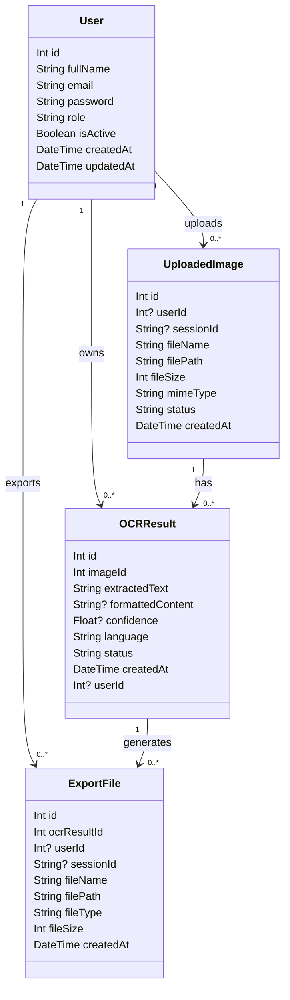
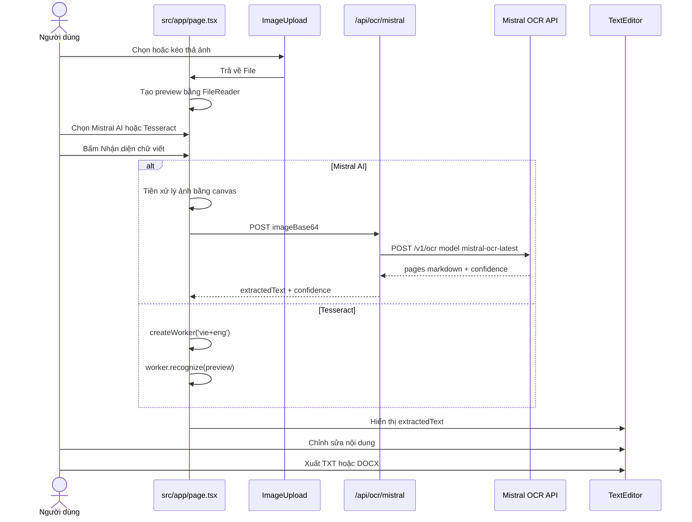

# Báo cáo hệ thống Scan2Word AI

## 1. Giới thiệu đề tài

Scan2Word AI là hệ thống web cho phép người dùng tải ảnh chứa chữ viết tay hoặc chữ in, sử dụng OCR/AI để nhận diện nội dung, sau đó chỉnh sửa và xuất thành file Word hoặc TXT.

Mục tiêu chính:

- Giảm thời gian gõ lại văn bản từ ảnh.
- Hỗ trợ nhận diện tiếng Việt và tiếng Anh.
- Cho phép người dùng chỉnh sửa kết quả OCR trước khi xuất file.
- Có chức năng quản trị người dùng, file xuất và thống kê.

## 2. Công nghệ sử dụng

| Nhóm | Công nghệ | Vị trí trong source | Vai trò |
| --- | --- | --- | --- |
| Frontend | Next.js 14, React 18 | `package.json:37-39`, `src/app/page.tsx` | Xây dựng giao diện và route của ứng dụng |
| UI | TailwindCSS, Radix UI, lucide-react | `package.json:23-31`, `package.json:36`, `tailwind.config.ts` | Tạo giao diện, component, icon |
| Upload ảnh | react-dropzone | `package.json:40`, `src/components/image-upload.tsx:25-35` | Kéo thả/chọn file JPG, PNG, giới hạn 10MB |
| OCR AI | Mistral OCR API | `src/app/api/ocr/mistral/route.ts:61-76` | Gọi API `https://api.mistral.ai/v1/ocr`, model `mistral-ocr-latest` |
| OCR offline | Tesseract.js | `package.json:44`, `src/app/page.tsx:125-143` | OCR dự phòng chạy phía client với ngôn ngữ `vie+eng` |
| Database ORM | Prisma Client | `package.json:22`, `src/lib/db.ts:1-13` | Kết nối và thao tác database |
| Database | SQLite | `prisma/schema.prisma:5-8`, file `prisma/dev.db` | Lưu người dùng, ảnh upload, kết quả OCR, file xuất |
| Xác thực | bcryptjs, jsonwebtoken | `package.json:32`, `package.json:35`, `src/lib/auth.ts:14-30` | Hash mật khẩu và tạo/kiểm tra JWT |
| Validation | zod | `package.json:45`, `src/lib/validations.ts` | Kiểm tra dữ liệu đầu vào |
| Xuất file | Blob, XML WordprocessingML, ZIP tự tạo | `src/components/text-editor.tsx:49-70`, `src/components/text-editor.tsx:178-548` | Tạo TXT và DOCX phía client |

## 3. Luồng hoạt động tổng quát của hệ thống

1. Người dùng vào trang chính `src/app/page.tsx`.
2. Hệ thống tạo hoặc lấy `sessionId` trong `sessionStorage` tại `src/app/page.tsx:32-39`.
3. Hệ thống kiểm tra người dùng đã đăng nhập chưa qua API `/api/auth/me` tại `src/app/page.tsx:45-55`.
4. Người dùng tải ảnh lên bằng component `ImageUpload` tại `src/components/image-upload.tsx:16-35`.
5. Trang chính tạo preview ảnh bằng `FileReader` tại `src/app/page.tsx:70-80`.
6. Người dùng chọn engine OCR:
   - Mistral AI: mặc định tại `src/app/page.tsx:29`.
   - Tesseract: dự phòng offline tại `src/app/page.tsx:125-143`.
7. Khi bấm "Nhận diện chữ viết", hàm `handleProcessOCR` chạy tại `src/app/page.tsx:89-175`.
8. Nếu chọn Mistral:
   - Ảnh được tiền xử lý bằng canvas tại `src/app/page.tsx:384-495`.
   - Frontend gọi `/api/ocr/mistral` tại `src/app/page.tsx:102-109`.
   - Backend gọi Mistral OCR API tại `src/app/api/ocr/mistral/route.ts:61-76`.
9. Nếu chọn Tesseract:
   - Frontend import `tesseract.js` động tại runtime tại `src/app/page.tsx:126`.
   - Worker OCR chạy với `vie+eng` tại `src/app/page.tsx:128-137`.
10. Kết quả OCR được gán vào state `extractedText` tại `src/app/page.tsx:148-150`.
11. Kết quả hiển thị trong `TextEditor` tại `src/app/page.tsx:307-313`.
12. Người dùng chỉnh sửa text trong textarea tại `src/components/text-editor.tsx:121-127`.
13. Người dùng xuất:
   - TXT: `src/components/text-editor.tsx:49-59`.
   - DOCX: `src/components/text-editor.tsx:61-70`, tạo nội dung Word tại `src/components/text-editor.tsx:178-233`.

Lưu ý quan trọng khi viết báo cáo: source hiện tại có API upload và API export lưu database, nhưng luồng trang chính đang OCR trực tiếp từ preview và xuất DOCX/TXT phía client. Chưa thấy code tạo bản ghi `OCRResult` trong luồng OCR hiện tại. Bảng `OCRResult` đã được khai báo trong Prisma, và API history/admin file đọc từ bảng này, nhưng cần bổ sung logic lưu OCR nếu muốn lịch sử hoạt động đầy đủ.

## 4. OCR được tích hợp ở đâu?

### 4.1. Mistral AI OCR

Vị trí tích hợp:

- Frontend chọn engine Mistral: `src/app/page.tsx:19`, `src/app/page.tsx:29`, `src/app/page.tsx:218-240`.
- Frontend gọi API Mistral nội bộ: `src/app/page.tsx:98-123`.
- Backend nhận request OCR: `src/app/api/ocr/mistral/route.ts:8-35`.
- Backend đọc API key: `src/app/api/ocr/mistral/route.ts:19-25`.
- Backend gọi Mistral OCR API: `src/app/api/ocr/mistral/route.ts:61-76`.
- Model AI/OCR sử dụng: `mistral-ocr-latest` tại `src/app/api/ocr/mistral/route.ts:69`.
- Backend gom text từ `pages[].markdown`: `src/app/api/ocr/mistral/route.ts:89-98`.
- Backend tính confidence: `src/app/api/ocr/mistral/route.ts:108-129`.

Chú thích code bằng tiếng Việt:

- `src/app/page.tsx:98-123`: Nếu engine là Mistral, frontend chuẩn bị ảnh, gọi API `/api/ocr/mistral`, nhận `extractedText` và `confidence`.
- `src/app/page.tsx:384-428`: Tiền xử lý ảnh trước OCR: load ảnh vào canvas, tìm vùng có mực/chữ, crop có padding, phóng to, nền trắng, tăng tương phản, rồi xuất thành JPEG base64.
- `src/app/api/ocr/mistral/route.ts:19-25`: Kiểm tra biến môi trường `MISTRAL_API_KEY`; nếu chưa cấu hình thì trả lỗi 500.
- `src/app/api/ocr/mistral/route.ts:61-76`: Gửi request POST đến Mistral OCR API, truyền model `mistral-ocr-latest` và ảnh dạng `image_url`.
- `src/app/api/ocr/mistral/route.ts:87-116`: Đọc JSON trả về, nối nội dung markdown của từng trang, format text, kiểm tra có ký tự đọc được, rồi trả về JSON cho frontend.

### 4.2. Tesseract.js OCR

Vị trí tích hợp:

- Dependency: `package.json:44`.
- Frontend import động: `src/app/page.tsx:126`.
- Tạo worker OCR ngôn ngữ Việt + Anh: `src/app/page.tsx:128`.
- Nhận diện ảnh preview: `src/app/page.tsx:136`.
- Tắt worker: `src/app/page.tsx:137`.

Chú thích code bằng tiếng Việt:

- `src/app/page.tsx:125-143`: Khi người dùng chọn Tesseract, ứng dụng tải thư viện `tesseract.js`, tạo worker với ngôn ngữ `vie+eng`, cập nhật tiến độ OCR qua logger, nhận diện trực tiếp trên ảnh preview và trả về text/confidence.

## 5. AI nào được sử dụng?

Hệ thống có 2 engine nhận diện:

1. Mistral AI OCR:
   - Là engine chính/mặc định.
   - Model: `mistral-ocr-latest`.
   - Chạy ở server route `src/app/api/ocr/mistral/route.ts`.
   - Cần biến môi trường `MISTRAL_API_KEY`.

2. Tesseract.js:
   - Là OCR dự phòng/offline.
   - Chạy phía trình duyệt.
   - Không cần API key.
   - Hỗ trợ ngôn ngữ `vie+eng`.

## 6. Database đang sử dụng cơ sở dữ liệu gì?

Database đang sử dụng: SQLite.

Bằng chứng:

- `prisma/schema.prisma:5-8`: datasource `db` khai báo `provider = "sqlite"` và lấy đường dẫn từ `DATABASE_URL`.
- Trong workspace có file database local: `prisma/dev.db`.
- Prisma Client được khởi tạo tại `src/lib/db.ts:1-13`.

Hệ thống có 4 bảng dữ liệu theo Prisma schema:

1. `User` tại `prisma/schema.prisma:10-23`.
2. `UploadedImage` tại `prisma/schema.prisma:25-38`.
3. `OCRResult` tại `prisma/schema.prisma:40-54`.
4. `ExportFile` tại `prisma/schema.prisma:56-69`.

## 7. Mô tả các bảng dữ liệu

### 7.1. Bảng User

Vị trí: `prisma/schema.prisma:10-23`.

Mục đích: Lưu thông tin tài khoản người dùng và admin.

Cột chính:

- `id`: khóa chính, tự tăng.
- `fullName`: họ tên người dùng.
- `email`: email đăng nhập, unique.
- `password`: mật khẩu đã hash bằng bcrypt.
- `role`: `user` hoặc `admin`.
- `isActive`: trạng thái tài khoản.
- `createdAt`, `updatedAt`: thời gian tạo/cập nhật.

Quan hệ:

- 1 User có nhiều `UploadedImage`.
- 1 User có nhiều `OCRResult`.
- 1 User có nhiều `ExportFile`.

### 7.2. Bảng UploadedImage

Vị trí: `prisma/schema.prisma:25-38`.

Mục đích: Lưu thông tin ảnh người dùng upload.

Cột chính:

- `id`: khóa chính.
- `userId`: người upload nếu đã đăng nhập.
- `sessionId`: định danh khách nếu chưa đăng nhập.
- `fileName`: tên file gốc.
- `filePath`: đường dẫn file trong `public/uploads`.
- `fileSize`: kích thước file.
- `mimeType`: loại file.
- `status`: `pending`, `processed`, `failed`.
- `createdAt`: thời gian upload.

Code tạo bản ghi: `src/app/api/upload/route.ts:70-81`.

### 7.3. Bảng OCRResult

Vị trí: `prisma/schema.prisma:40-54`.

Mục đích: Lưu kết quả nhận diện chữ từ ảnh.

Cột chính:

- `id`: khóa chính.
- `imageId`: khóa ngoại tới ảnh upload.
- `extractedText`: văn bản OCR.
- `formattedContent`: nội dung đã định dạng nếu có.
- `confidence`: độ tin cậy OCR.
- `language`: ngôn ngữ, mặc định `vie`.
- `status`: trạng thái, mặc định `completed`.
- `createdAt`: thời gian tạo.
- `userId`: người sở hữu kết quả nếu đã đăng nhập.

Lưu ý hiện trạng source: có API đọc lịch sử từ bảng này tại `src/app/api/files/history/route.ts:31-50`, nhưng chưa thấy route trong source hiện tại tạo `OCRResult`. Khi viết báo cáo, nên ghi rõ "schema đã thiết kế bảng OCRResult, cần bổ sung chức năng lưu kết quả OCR để lịch sử hoạt động đầy đủ".

### 7.4. Bảng ExportFile

Vị trí: `prisma/schema.prisma:56-69`.

Mục đích: Lưu thông tin file đã xuất.

Cột chính:

- `id`: khóa chính.
- `ocrResultId`: khóa ngoại tới kết quả OCR.
- `userId`: người xuất file nếu có.
- `sessionId`: khách nếu không đăng nhập.
- `fileName`: tên file.
- `filePath`: đường dẫn file.
- `fileType`: `docx`, `txt`, `pdf`.
- `fileSize`: kích thước file.
- `createdAt`: thời gian xuất.

Code tạo bản ghi: `src/app/api/files/export/route.ts:64-75`.

## 8. Class diagram

Có thể chèn Mermaid sau vào báo cáo hoặc công cụ hỗ trợ Mermaid:

## 9. Sequence flow OCR

## 10. Chức năng chính và file xử lý

| Chức năng | File | Dòng | Giải thích |
| --- | --- | --- | --- |
| Trang chính upload/OCR/edit | `src/app/page.tsx` | `21-175`, `177-381` | Quản lý state, chọn OCR engine, xử lý OCR, render giao diện |
| Tiền xử lý ảnh | `src/app/page.tsx` | `384-495` | Crop vùng có chữ, phóng to, nền trắng, tăng contrast |
| Component upload | `src/components/image-upload.tsx` | `16-35`, `70-90` | Kéo thả/chọn ảnh và preview |
| OCR Mistral backend | `src/app/api/ocr/mistral/route.ts` | `8-140` | Nhận image base64, gọi Mistral OCR, format kết quả |
| Editor và xuất file | `src/components/text-editor.tsx` | `18-176`, `178-548` | Sửa text, copy, xuất TXT/DOCX |
| Upload file vào server | `src/app/api/upload/route.ts` | `10-99` | Lưu ảnh vào `public/uploads` và tạo bản ghi `UploadedImage` |
| Xuất file vào server | `src/app/api/files/export/route.ts` | `10-93` | Tạo file TXT/DOCX placeholder và lưu `ExportFile` nếu có `ocrResultId` |
| Lịch sử OCR | `src/app/api/files/history/route.ts` | `5-66` | Đọc bảng `OCRResult` theo user/session |
| Quản lý file admin | `src/app/admin/files/page.tsx` | `59-321` | Hiển thị, tìm kiếm, xem chi tiết, xóa file xuất |
| API file admin | `src/app/api/files/route.ts` | `5-99` | Admin lấy danh sách/xóa `ExportFile` |
| Thống kê admin | `src/app/api/admin/stats/route.ts` | `19-66` | Đếm user, ảnh upload, file xuất |
| Đăng ký | `src/app/api/auth/register/route.ts` | `6-75` | Validate, hash password, tạo user, set cookie |
| Đăng nhập | `src/app/api/auth/login/route.ts` | `6-78` | Kiểm tra user/password, tạo JWT, set cookie |
| Auth helper | `src/lib/auth.ts` | `14-69` | Hash/compare password, tạo/verify JWT, set/clear cookie |
| Prisma client | `src/lib/db.ts` | `1-13` | Khởi tạo PrismaClient dùng chung |

## 11. Comment chi tiết code theo từng khối quan trọng

### `src/app/page.tsx`

- `19`: Định nghĩa 2 engine OCR là `tesseract` và `mistral`.
- `21-30`: Khai báo state cho user, file được chọn, preview ảnh, text đã OCR, progress và engine OCR.
- `32-43`: Khi trang load, tạo `sessionId` cho khách và kiểm tra đăng nhập.
- `70-80`: Khi chọn file, lưu file vào state và dùng `FileReader` tạo base64 preview.
- `89-175`: Hàm xử lý OCR chính. Hàm này phân nhánh theo engine, gọi Mistral hoặc Tesseract, cập nhật progress, lưu kết quả vào `extractedText`, hiển thị toast thành công/thất bại.
- `98-123`: Nhánh Mistral: tiền xử lý ảnh, gọi API `/api/ocr/mistral`, nhận text và confidence.
- `125-143`: Nhánh Tesseract: tạo worker OCR tại client, nhận diện ảnh preview, lấy `data.text` và `data.confidence`.
- `307-313`: Truyền kết quả OCR sang `TextEditor` để người dùng chỉnh sửa và xuất file.
- `384-495`: Các hàm tiền xử lý ảnh: load ảnh, tìm vùng có mực, crop, scale, tăng contrast.

### `src/app/api/ocr/mistral/route.ts`

- `8-17`: Nhận request POST và kiểm tra có `imageBase64`.
- `19-25`: Lấy `MISTRAL_API_KEY` từ biến môi trường.
- `27-28`: Chuẩn hóa data URL của ảnh và gọi hàm OCR.
- `53-59`: Nếu ảnh chưa có prefix `data:image/...`, thêm prefix JPEG base64.
- `61-76`: Gọi Mistral OCR API với model `mistral-ocr-latest`.
- `78-85`: Nếu API lỗi, trả về status và thông báo lỗi.
- `87-98`: Đọc kết quả JSON và nối markdown của từng trang thành text.
- `103-106`: Format text và kiểm tra text đọc được.
- `110-116`: Trả về kết quả cho frontend gồm `extractedText`, `rawText`, `source`, `confidence`.

### `src/components/text-editor.tsx`

- `31-35`: Copy nội dung OCR vào clipboard.
- `49-59`: Tạo file TXT bằng Blob và kích hoạt download.
- `61-70`: Tạo file DOCX bằng Blob và kích hoạt download.
- `121-127`: Textarea cho phép người dùng sửa nội dung OCR.
- `178-233`: Tạo cấu trúc file DOCX tối thiểu gồm `[Content_Types].xml`, relationship, styles và document XML.
- `235-260`: Chuyển từng dòng text thành paragraph/table XML.
- `262-283`: Xử lý heading, bullet và căn lề paragraph.
- `319-393`: Nhận diện và tạo bảng từ markdown table.
- `437-548`: Tạo ZIP thủ công cho file DOCX.

### `src/app/api/upload/route.ts`

- `10-15`: Nhận `formData`, lấy file và `sessionId`.
- `16-26`: Lấy token từ cookie để xác định user đăng nhập.
- `35-42`: Chỉ chấp nhận JPG/PNG.
- `44-51`: Giới hạn kích thước file 10MB.
- `53-68`: Tạo thư mục upload, đặt tên file duy nhất, ghi file vào `public/uploads`.
- `70-81`: Tạo bản ghi `UploadedImage` trong database.

### `src/app/api/files/export/route.ts`

- `10-20`: Nhận text, tên file, loại file và kiểm tra text không rỗng.
- `22-31`: Lấy user từ JWT cookie nếu đã đăng nhập.
- `33-36`: Tạo thư mục `public/exports`.
- `42-49`: Nếu xuất TXT thì ghi nội dung text thật ra file.
- `50-62`: Nếu xuất DOCX thì tạo file placeholder trên server; file DOCX thực tế đang được tạo phía client trong `TextEditor`.
- `64-75`: Nếu có `userId` và `ocrResultId`, tạo bản ghi `ExportFile`.

## 12. Nhận xét thiết kế hiện tại

Điểm mạnh:

- Tách frontend, API route và database khá rõ.
- Có 2 engine OCR: Mistral AI chính xác hơn và Tesseract offline.
- Có schema database cho user, upload, OCR result và export file.
- Có chức năng admin quản lý user/file và xem thống kê.

Điểm cần cải thiện để báo cáo chặt hơn:

- Cần bổ sung logic lưu `OCRResult` sau khi OCR thành công, vì hiện tại API history/admin file phụ thuộc bảng này.
- Cần đồng bộ luồng upload: trang chính hiện đang OCR từ preview, chưa gọi `/api/upload`.
- Cần đồng bộ luồng export: `TextEditor` đang xuất client-side, trong khi API `/api/files/export` có logic lưu database.
- Nên sửa encoding hiển thị tiếng Việt trong một số file/source nếu bị lỗi font.

## 13. Gợi ý cấu trúc báo cáo chi tiết

Bạn có thể viết báo cáo theo cấu trúc sau:

1. Mở đầu
   - Lý do chọn đề tài.
   - Mục tiêu của hệ thống.
   - Phạm vi chức năng.

2. Cơ sở lý thuyết
   - OCR là gì.
   - So sánh OCR truyền thống và AI OCR.
   - Giới thiệu Mistral OCR và Tesseract.js.
   - Giới thiệu Next.js, Prisma, SQLite.

3. Phân tích yêu cầu
   - Tác nhân: khách, người dùng, admin.
   - Use case: đăng ký, đăng nhập, tải ảnh, OCR, chỉnh sửa, xuất file, xem lịch sử, quản lý user/file.
   - Yêu cầu phi chức năng: dễ dùng, xử lý nhanh, bảo mật mật khẩu, giới hạn file 10MB.

4. Thiết kế hệ thống
   - Kiến trúc tổng quan: client Next.js, API routes, Prisma, SQLite, Mistral API.
   - Flow OCR.
   - Class diagram.
   - Mô tả database.

5. Cài đặt hệ thống
   - Trình bày các file quan trọng theo bảng ở mục 10.
   - Mô tả chi tiết luồng OCR Mistral và Tesseract.
   - Mô tả luồng xuất DOCX/TXT.
   - Mô tả xác thực và phân quyền admin.

6. Kết quả đạt được
   - Giao diện upload ảnh.
   - Kết quả nhận diện text.
   - Màn hình chỉnh sửa/xuất file.
   - Trang admin dashboard, users, files.

7. Hạn chế và hướng phát triển
   - Lưu kết quả OCR vào database đầy đủ.
   - Cải thiện độ chính xác OCR với tiền xử lý ảnh tốt hơn.
   - Thêm xuất PDF.
   - Thêm lịch sử cho khách theo session.
   - Thêm test và logging.

8. Kết luận
   - Tóm tắt mục tiêu đã đạt.
   - Giá trị ứng dụng của hệ thống.

## 14. Đoạn mẫu viết báo cáo

### Mô tả kiến trúc

Hệ thống Scan2Word AI được xây dựng theo kiến trúc web full-stack sử dụng Next.js. Phía client đảm nhận giao diện upload ảnh, chọn engine OCR, hiển thị kết quả và xuất file. Phía server sử dụng API Routes của Next.js để xử lý các tác vụ như đăng nhập, đăng ký, upload file, quản lý file và gọi dịch vụ Mistral OCR. Tầng dữ liệu được quản lý bằng Prisma ORM kết nối đến SQLite, giúp thao tác với các bảng User, UploadedImage, OCRResult và ExportFile một cách rõ ràng.

### Mô tả luồng OCR

Khi người dùng tải ảnh lên, ứng dụng tạo preview bằng FileReader và cho phép chọn một trong hai engine OCR. Nếu chọn Mistral AI, ảnh được tiền xử lý bằng canvas để cắt vùng có chữ, phóng to và tăng tương phản, sau đó gửi đến API `/api/ocr/mistral`. API này tiếp tục gọi Mistral OCR với model `mistral-ocr-latest`, nhận về nội dung markdown của từng trang và trả lại text cho giao diện. Nếu chọn Tesseract, OCR được thực hiện trực tiếp trên trình duyệt bằng worker `tesseract.js` với ngôn ngữ `vie+eng`.

### Mô tả database

Cơ sở dữ liệu của hệ thống sử dụng SQLite và được khai báo trong Prisma schema. Hệ thống có 4 bảng chính: User lưu thông tin tài khoản, UploadedImage lưu thông tin ảnh đã tải lên, OCRResult lưu kết quả nhận diện văn bản, và ExportFile lưu thông tin file đã xuất. Các bảng có mối quan hệ một-nhiều: một người dùng có thể upload nhiều ảnh, một ảnh có thể có nhiều kết quả OCR, và một kết quả OCR có thể sinh ra nhiều file xuất.
