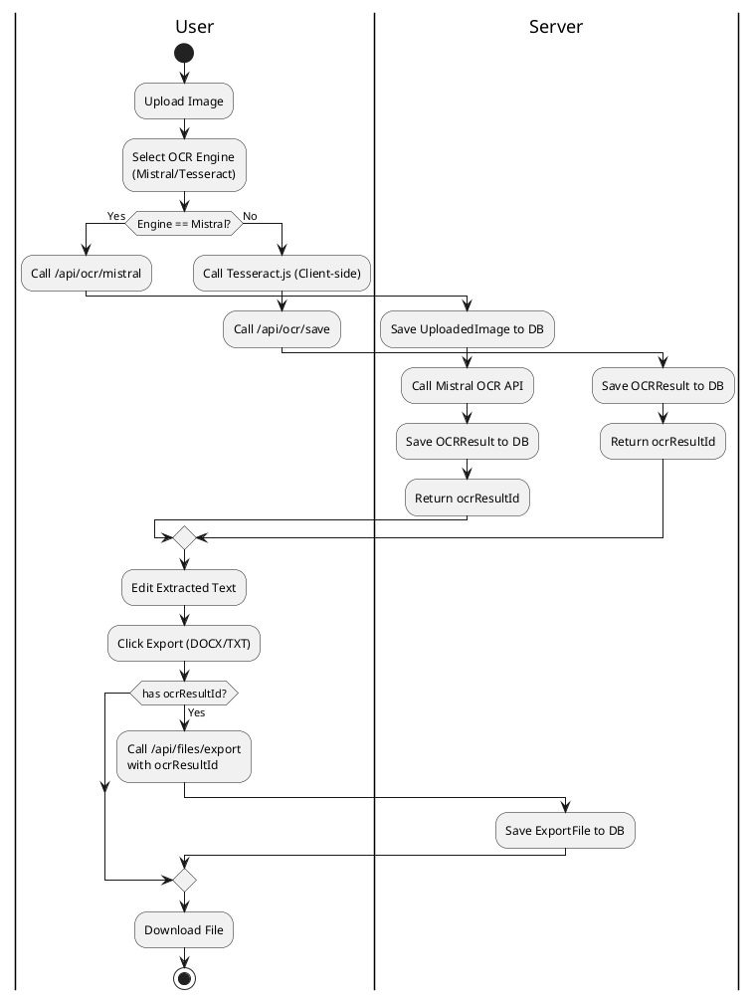
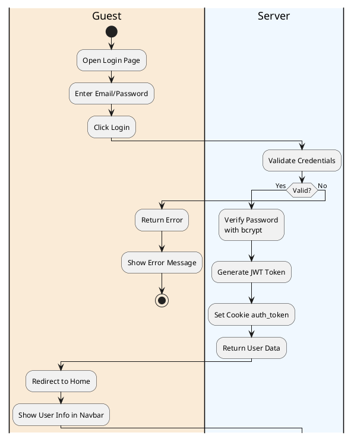
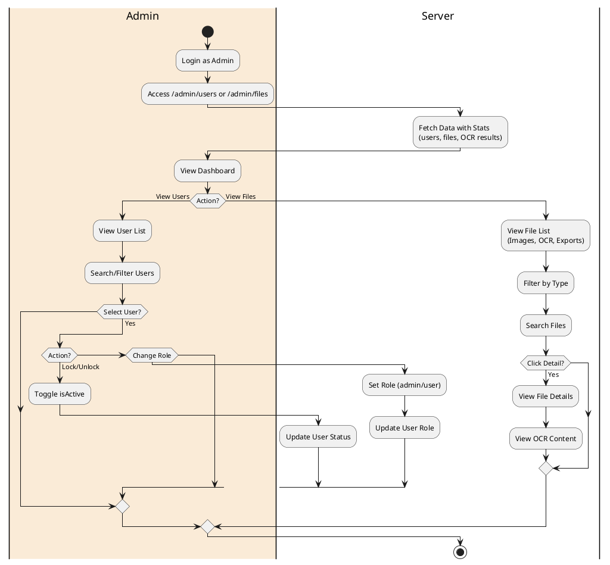
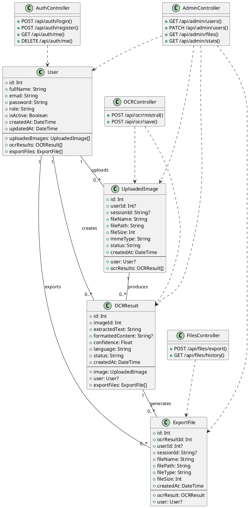
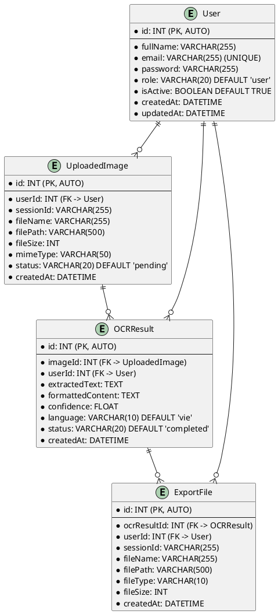
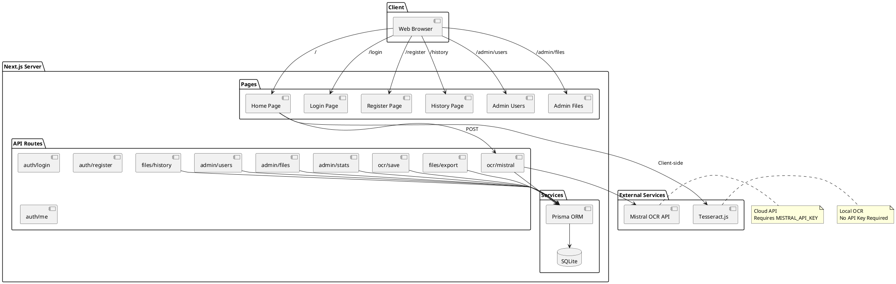
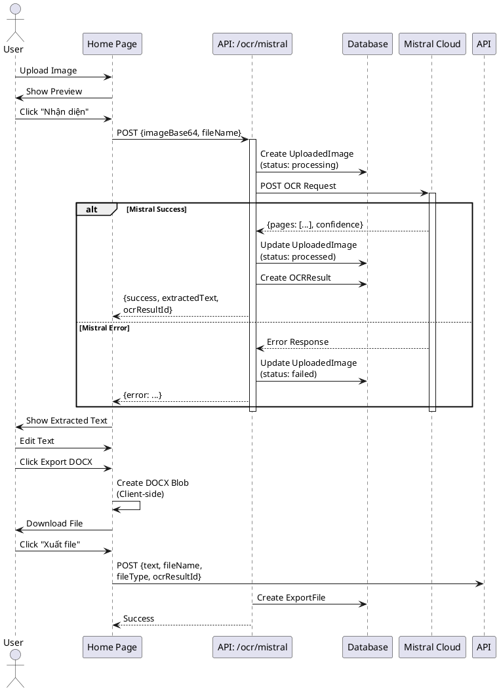

# Scan2Word AI - Tài liệu Kiến trúc Hệ thống

## 1. Sơ đồ Hoạt động (Activity Diagram)

### 1.1 Quy trình OCR và Xuất File

### 1.2 Quy trình Đăng nhập

### 1.3 Quy trình Admin Quản lý

---

## 2. Sơ đồ Class (Class Diagram)

---

## 3. Sơ đồ Database Schema

---

## 4. Chi tiết các Bảng Database

### 4.1 Bảng User

| Trường | Kiểu | Mô tả |
|--------|------|-------|
| `id` | INT (PK) | Khóa chính, tự động tăng |
| `fullName` | VARCHAR(255) | Họ tên người dùng |
| `email` | VARCHAR(255) | Email (duy nhất, đăng nhập) |
| `password` | VARCHAR(255) | Mật khẩu đã mã hóa bcrypt |
| `role` | VARCHAR(20) | `'admin'` hoặc `'user'` |
| `isActive` | BOOLEAN | Trạng thái tài khoản (kích hoạt/khóa) |
| `createdAt` | DATETIME | Thời gian tạo tài khoản |
| `updatedAt` | DATETIME | Thời gian cập nhật cuối |

### 4.2 Bảng UploadedImage

| Trường | Kiểu | Mô tả |
|--------|------|-------|
| `id` | INT (PK) | Khóa chính, tự động tăng |
| `userId` | INT (FK) | Người dùng đã upload (nullable cho khách) |
| `sessionId` | VARCHAR(255) | Session ID cho người dùng chưa đăng nhập |
| `fileName` | VARCHAR(255) | Tên file gốc |
| `filePath` | VARCHAR(500) | Đường dẫn lưu trữ trong `/public/uploads/` |
| `fileSize` | INT | Kích thước file (bytes) |
| `mimeType` | VARCHAR(50) | Loại file: `image/jpeg`, `image/png` |
| `status` | VARCHAR(20) | `'pending'` / `'processing'` / `'processed'` / `'failed'` |
| `createdAt` | DATETIME | Thời gian upload |

### 4.3 Bảng OCRResult

| Trường | Kiểu | Mô tả |
|--------|------|-------|
| `id` | INT (PK) | Khóa chính, tự động tăng |
| `imageId` | INT (FK) | Ảnh gốc đã xử lý |
| `userId` | INT (FK) | Người dùng thực hiện OCR |
| `extractedText` | TEXT | Văn bản đã trích xuất |
| `formattedContent` | TEXT | Nội dung đã định dạng (markdown) |
| `confidence` | FLOAT | Độ chính xác (0.0 - 1.0) |
| `language` | VARCHAR(10) | Ngôn ngữ phát hiện, mặc định `'vie'` |
| `status` | VARCHAR(20) | `'completed'` / `'failed'` |
| `createdAt` | DATETIME | Thời gian hoàn thành OCR |

### 4.4 Bảng ExportFile

| Trường | Kiểu | Mô tả |
|--------|------|-------|
| `id` | INT (PK) | Khóa chính, tự động tăng |
| `ocrResultId` | INT (FK) | Kết quả OCR liên quan |
| `userId` | INT (FK) | Người dùng xuất file |
| `sessionId` | VARCHAR(255) | Session cho khách |
| `fileName` | VARCHAR(255) | Tên file xuất |
| `filePath` | VARCHAR(500) | Đường dẫn lưu trong `/public/exports/` |
| `fileType` | VARCHAR(10) | `'docx'` / `'txt'` / `'pdf'` |
| `fileSize` | INT | Kích thước file (bytes) |
| `createdAt` | DATETIME | Thời gian xuất file |

---

## 5. Sơ đồ API Flow

---

## 6. Sơ đồ Sequence - OCR Flow

---

## 7. Mô tả các API Endpoints

### Authentication APIs

| Method | Endpoint | Mô tả |
|--------|----------|-------|
| POST | `/api/auth/login` | Đăng nhập, trả về JWT token |
| POST | `/api/auth/register` | Đăng ký tài khoản mới |
| GET | `/api/auth/me` | Lấy thông tin user hiện tại |
| DELETE | `/api/auth/me` | Đăng xuất (xóa token) |

### OCR APIs

| Method | Endpoint | Mô tả |
|--------|----------|-------|
| POST | `/api/ocr/mistral` | Xử lý OCR với Mistral AI, lưu vào DB |
| POST | `/api/ocr/save` | Lưu kết quả OCR (Tesseract) |

### File APIs

| Method | Endpoint | Mô tả |
|--------|----------|-------|
| POST | `/api/files/export` | Xuất file DOCX/TXT, lưu vào DB |
| GET | `/api/files/history` | Lấy lịch sử file của user |

### Admin APIs

| Method | Endpoint | Mô tả |
|--------|----------|-------|
| GET | `/api/admin/users` | Danh sách users + thống kê |
| PATCH | `/api/admin/users` | Cập nhật user (role, isActive) |
| GET | `/api/admin/files` | Danh sách files (images, OCR, exports) |
| GET | `/api/admin/stats` | Thống kê hệ thống |
